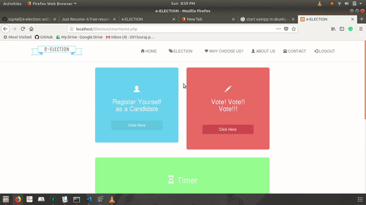

## E-Election  

Online Election Portal

### Installation

Step to run this web-application

1. Clone this repo

2. Install xampp for window or linux

3. Copy this repo into  xampp->htdocs

4. open browser

5. Start XAMPP and then open localhost/E-Election/Index.php

(NOTE: If u change port ie,81 then type localhost:81/E-Election/Index.php)

6. Contact in case of any error

### E-Election working 1

### E-Election working 2

### License

[(Back to top)](#installation)
The MIT License 2017 

### Developers

[Suraj pawar](https://github.com/ssp4all).
[Raaj Raisinghani](https://github.com/raajr10)
